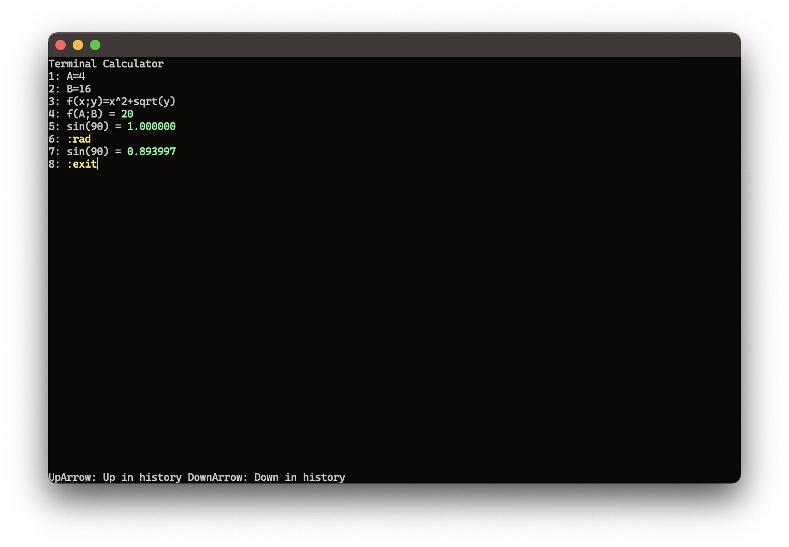

# Terminal Calculator



## Introduction
`TerminalCalculator` is a `ncurses`-based calculator with real-time parsing and colorization.
It runs on both Unix based operating systems and Windows.

Besides supporting common arithmetic operations, `TerminalCalculator` also enables the use of numeric variables and custom functions.
Also, a selection of pre-defined functions such as `abs`, `ceil`, and `floor` alongside trigonometric functions and others can be utilized.

## Dependencies
Before trying to build `TerminalCalculator`, please make sure to clone all submodules within this repository.

- [googletest](https://github.com/google/googletest): Test framework.
- [PDCurses](https://github.com/wmcbrine/PDCurses) (only Windows): `ncurses` replacement for Windows.
- [RE2](https://github.com/google/re2): Regex library for most of `TerminalCalculator`'s regex expressions.
- [yaml-cpp](https://github.com/jbeder/yaml-cpp): YAML parser.

On Unix machines `TerminalCalculator` also requires `ncurses` to be installed.

## Build instructions
`TerminalCalculator` uses `CMake` for its build configuration.
Therefore, after navigating to the project folder, execute following commands:

```bash
mkdir build
cd build
cmake [-G generator] ..
```

Choosing a specific generator is optional.

Finally, execute the build command associated with the generator you chose earlier.
The `TerminalCalculator` binary can be found inside the `src` subfolder within the build-folder.

## Usage
A complete list of all supported features can be found in [usage](doc/usage.md).

## Configuration
`TerminalCalculator`'s behavior and appearance can be configured using dedicated configuration files.
For more details head over to [configuration](doc/configuration.md).

## Known issues
- `TerminalCalculator` behaves incorrectly when changing its window size.

## Future development
`TerminalCalculator` is far from being complete.
In the following you can find a set of features and points of interest for future development.

- __Expand colorization__: Currently, `TerminalCalculator`'s colorization support is limited as the basic functionality of this calculator was prioritized over its styling during the development process.
- __RPN mode/stack-based calculator__
